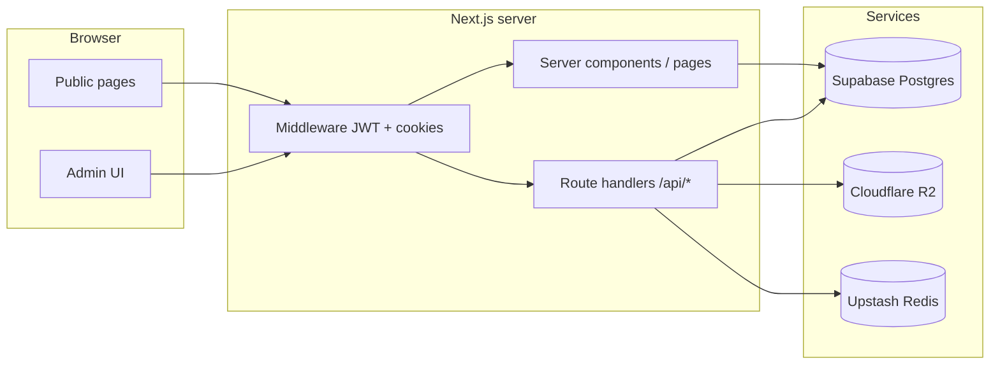

# Kpai Family Contributions — Project Documentation

This document describes how this application is built, what it does, and what to consider when adapting it for another context (for example, a **church** with **many administrators**). It is meant as a **blueprint**, not a step-by-step tutorial.

---

## 1. What the product does

- **Public area (`/`)**  
  Visitors enter a **numeric access code**. Valid codes set a `viewer_session` cookie and redirect to the **read-only dashboard** (`/dashboard`), which lists members (with optional anonymity), payment progress, balances, and filters.

- **Admin area (`/admin/*`)**  
  Authenticated staff manage **members**, record **payments**, maintain a **monthly checklist** (who has paid for the current month), adjust **per-member or global rates**, issue **access codes**, generate **PDF + WhatsApp-style reports**, and review **audit logs** (super admin).

- **Roles**  
  - **`super`**: full access, including **Settings** (global rate), **Audit log**, and **creating other admin accounts**.  
  - **`admin`**: day-to-day operations; **cannot** open `/admin/settings` or `/admin/audit` (middleware redirects to `/admin`).

There is **no multi-tenant model** in the codebase: one deployment assumes **one group** (one family / one congregation’s data).

---

## 2. Technology stack

| Layer | Choice |
|--------|--------|
| Framework | **Next.js** (App Router), **React** |
| Database | **Supabase** (PostgreSQL), accessed mostly via **service role** on the server |
| Admin auth | **Custom**: passwords in DB (`bcrypt`), **JWT** in httpOnly cookie (`admin_token`), signed with **jose** |
| Public dashboard gate | **Access codes** in DB + **`viewer_session`** cookie (opaque session, not a JWT) |
| Object storage (reports) | **Cloudflare R2** via **S3-compatible API** (`@aws-sdk/client-s3`) |
| Rate limiting | **Upstash Redis** (optional; code degrades if env vars missing) |
| PDFs | **pdf-lib** (server-side); text must stay **WinAnsi-safe** for standard PDF fonts |
| Styling | **Tailwind CSS** v4, custom “neumorphic” tokens in `globals.css` |

---

## 3. High-level architecture



- **Server components** load data with `createSupabaseServerClient()` (service role + cookie adapter).  
- **API routes** repeat the same pattern: verify session (admin JWT or public rules), then Supabase reads/writes.  
- **Middleware** only enforces **presence/validity of cookies** and **super-only paths**; it does not load the database.

---

## 4. Domain model (conceptual schema)

The TypeScript types in `src/lib/types.ts` mirror the main tables. Below is the **intended meaning** of each entity.

### `members`

- Identity: `name`, `branch`, `active`, `anonymous` (hides name on public dashboard), `start_date` (when contributions obligation begins), `credit_balance` (currency units carried as credit toward future months).

### `member_rates`

- Time-series of **monthly amounts** per member.  
- `source`: `global` (follows org default history) vs `override` (fixed for that member).  
- `effective_from`: date the rate **starts**; `getMemberRateForMonth` picks the latest rate on or before the first of each calendar month.

### `global_rate_history`

- History of the **default** monthly rate for members on the global track (who do not use overrides).

### `payments`

- `amount`, `date_paid`, `note`, `member_id`.  
- **`months_covered`**, **`credit_used`**, **`credit_remainder`**: derived when a payment is posted using `allocatePayment()` (`src/lib/utils/allocation.ts`) — how many full months the payment covers at the **current** effective rate plus existing credit, and leftover as new `credit_balance` on the member.

### `monthly_checklist`

- One row per **member** per **month** (month key stored as `YYYY-MM-01`).  
- `paid` + optional `payment_id`: used for “paid this month” in reports and admin home metrics.

### `admins`

- `email`, `password_hash`, `role` (`super` | `admin`), `must_reset_password`, `created_by`, timestamps.  
- New admins created by super get a temporary password and **must** complete first-time reset (`/admin/first-time-reset` + `reset_required` cookie flow).

### `access_codes`

- `code`, `label`, `active`, `created_by`.  
- Validated by `/api/codes/validate` with rate limiting; success sets `viewer_session`.

### `reports`

- Per calendar month: `pdf_url` (nullable if R2 not configured), `text_summary` (WhatsApp-oriented text), `triggered_by` (admin id), `generated_at`.

### `audit_logs`

- Append-only style events: `event_type`, `actor_id`, `actor_role`, IP, user agent, `metadata` JSON.

---

## 5. Core business logic

### Expected total and balance

Defined in `src/lib/utils/rate-calculator.ts`:

- **`calculateExpectedTotal`**: sum of **applicable monthly rate** for each calendar month from member `start_date` (month-aligned) through **current month** (inclusive).  
- **`calculateBalance`**:  
  `expectedTotal - totalPaid - creditBalance`  
  - **Positive** → behind.  
  - **Negative** → ahead (overpaid / credit).  
  - Near zero → paid up.

### Payment allocation

`allocatePayment` uses **today’s** effective rate (`getMemberRateForMonth`) plus **existing** `credit_balance` to compute how many **full months** the new payment covers and the new remainder stored as credit.

### Reports

- **`/api/reports/generate`**: loads members, rates, payments, checklist for the chosen month; builds WhatsApp text (`report-formatter`); builds PDF (`pdf-generator`); uploads PDF to R2 if configured; upserts `reports` row.  
- PDF uses **standard fonts**; avoid Unicode symbols not in WinAnsi in PDF strings.

### Public dashboard

- `src/app/(public)/dashboard/page.tsx` aggregates the same balance logic for **all** members and passes rows into `DashboardMemberList`.  
- Display helpers: `src/lib/utils/member-payment-subtitle.ts` (paid / remaining / ahead / fully paid up + colors).

---

## 6. Route map (reference)

### App routes

| Path | Notes |
|------|--------|
| `/` | Code entry |
| `/dashboard` | Requires `viewer_session` |
| `/admin/login`, `/admin/forgot-password`, `/admin/reset-password` | Auth |
| `/admin/first-time-reset` | Requires `reset_required` cookie |
| `/admin` | Home metrics, recent payments, “most behind” |
| `/admin/members`, `/admin/members/[id]` | Member list + detail |
| `/admin/checklist/[month]` | Monthly paid checklist |
| `/admin/reports` | Past reports + generate modal |
| `/admin/codes` | Access codes |
| `/admin/settings` | **Super only** — global rate |
| `/admin/audit` | **Super only** |

### API routes (non-exhaustive)

- **Auth**: `/api/auth/login`, `logout`, `forgot-password`, `reset-password`, `first-time-reset`  
- **Admin**: `/api/admin/accounts` (POST super-only create), `/api/admin/accounts/[id]`  
- **Domain**: `/api/members`, `/api/members/[id]`, `/api/payments`, `/api/payments/[id]`, `/api/settings/global-rate`, `/api/reports/generate`, `/api/codes`, `/api/codes/validate`, `/api/codes/[id]`, `/api/audit`  

Each protected handler typically calls `getAdminSession(request)` and returns 401/403 as appropriate.

---

## 7. Security notes

- **JWT**: `JWT_SECRET`, issuer `kpai-family`, audience `kpai-admin`, **8h** expiry (`session.ts`).  
- **Middleware** uses the same secret to **verify** tokens for `/admin` (except login/forgot/reset/first-time-reset rules).  
- **Supabase**: server uses **`SUPABASE_SERVICE_ROLE_KEY`** — bypasses RLS; **all** authorization is in **application code**. Any new surface area must re-check session/role.  
- **Rate limiting**: Upstash in `src/lib/security/rate-limiter.ts` (e.g. code validation).  
- **Password reset**: token hashing and email flow in forgot/reset routes (uses `NEXT_PUBLIC_APP_URL` for links).

---

## 8. Environment variables

| Variable | Purpose |
|----------|---------|
| `NEXT_PUBLIC_SUPABASE_URL` | Supabase project URL |
| `SUPABASE_SERVICE_ROLE_KEY` | Server-only DB access |
| `NEXT_PUBLIC_SUPABASE_ANON_KEY` | Client Supabase (if used) |
| `JWT_SECRET` | Sign/verify admin JWT |
| `NEXT_PUBLIC_APP_URL` | Absolute URLs (emails, metadata, codes page) |
| `SUPER_ADMIN_EMAIL` | Used by hash utility (`password.ts`) when generating bootstrap hash |
| `SUPER_ADMIN_PASSWORD_HASH` | Typically used for initial super login bootstrap (see your deployment notes) |
| `UPSTASH_REDIS_REST_URL`, `UPSTASH_REDIS_REST_TOKEN` | Optional rate limits |
| `R2_ACCOUNT_ID`, `R2_ACCESS_KEY_ID`, `R2_SECRET_ACCESS_KEY`, `R2_BUCKET_NAME`, `R2_PUBLIC_URL` | PDF upload; if incomplete, reports still save **without** `pdf_url` |

`VERCEL_URL` is referenced in `layout.tsx` as a fallback for absolute URL in some environments.

---

## 9. Adapting for a church with **many** admins

This app already supports **multiple** `admins` plus one **`super`** who can create accounts. For a **larger** church deployment, you will likely want to extend the design.

### What you get today

- Flat `admins` table, two roles.  
- No per-ministry or per-campus scoping: every admin sees **all** members and payments.  
- Audit log records **who** did what, but not a separate “organization” dimension.

### Common extensions

1. **Multi-tenant / org key**  
   Add `organization_id` (or `church_id`) to `members`, `payments`, `reports`, `access_codes`, etc., and set it from session. Admins belong to one or more orgs. **Supabase Row Level Security** can enforce tenant isolation if you move away from sole reliance on the service role for everything.

2. **Finer roles**  
   Examples: `treasurer` (payments + reports), `secretary` (members + checklist), `viewer_admin` (read-only admin). Map routes in `middleware.ts` and mirror checks in each API route.

3. **Invitations instead of shared passwords**  
   Replace or supplement “super creates password” with email invites, magic links, or OAuth (Google/Microsoft), still storing a stable `admins` row or linking to Supabase Auth.

4. **Many supers vs one super**  
   Today only `super` creates admins. For a board model, you might allow multiple supers or a dedicated “owner” flag and **break-glass** policies.

5. **Public dashboard**  
   You might want **separate** access codes per campus or per “circle,” or replace codes with logged-in member accounts for privacy.

6. **Compliance and retention**  
   `AUDIT_RETENTION_MONTHS` exists in constants; ensure DB jobs or policies align with church policy.

### Scaling operations

- **Reports** and **PDF** generation are CPU-bound on the server; for heavy use, queue jobs (e.g. background worker) and store status on `reports`.  
- **R2** (or any S3 bucket) scales well for PDF hosting; ensure **CORS** and **public URL** match your domain if you harden access later.

---

## 10. Local development

```bash
npm install
npm run dev
```

- Copy env vars into `.env.local` (never commit secrets).  
- Without R2, report generation should still succeed with **WhatsApp text** and DB row; **PDF link** may be absent.  
- Without Upstash, rate limiting may no-op or use in-memory behavior depending on implementation — check `rate-limiter.ts`.

---

## 11. Key source files (quick index)

| Area | Files |
|------|--------|
| Types | `src/lib/types.ts` |
| Balance / rates | `src/lib/utils/rate-calculator.ts`, `src/lib/db/rates.ts` |
| Payment math | `src/lib/utils/allocation.ts` |
| Admin session | `src/lib/auth/session.ts`, `src/middleware.ts` |
| Supabase server | `src/lib/supabase/server.ts` |
| R2 | `src/lib/r2.ts` |
| Reports | `src/app/api/reports/generate/route.ts`, `src/lib/utils/pdf-generator.ts`, `src/lib/utils/report-formatter.ts` |
| Audit | `src/lib/db/audit.ts` |

---

## 12. License and branding

Product strings (for example `APP_NAME` in `src/lib/constants.ts`) and footer copy are project-specific; replace when forking for a church.

---

*Generated as project documentation for maintainers and for building similar systems. Update this file when architecture or env requirements change.*
